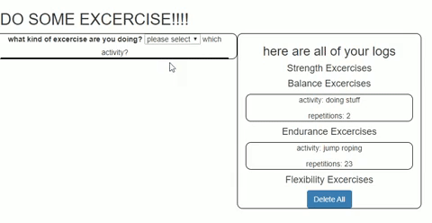

https://shawnfitnesstracker.herokuapp.com/

this is a excercist logger created with mongoDB, express and javascript. 

the user can either pick from existing excercise, or write in a customized activity. 

for the entirity of the session, the wrote-in activity will be present in the array of selections.

